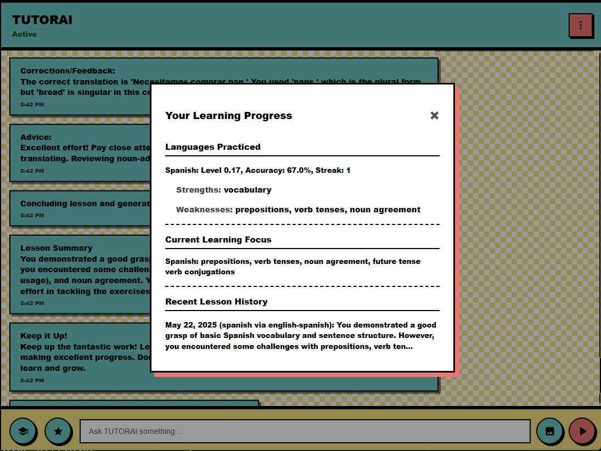

# TUTORAI - Local AI Chat & Language Tutor

TUTORAI is a desktop application that allows you to chat with local AI models (like those run with Ollama) in a privacy-focused environment. It also includes an integrated language learning tutor to help you practice new languages through interactive exercises. All your data, including chat history, settings, and learning progress, is stored locally on your machine.



## Features

*   **Local AI Chat**: Connect to your local Ollama instance and chat with various LLMs.
*   **Image Support**: Send images along with your text prompts to multimodal models.
*   **Language Tutoring**: Interactive language learning module with:
    *   Customizable language pairs (e.g., learn Spanish from English).
    *   Translation exercises.
    *   AI-driven feedback and corrections.
    *   Progress tracking (proficiency, strengths, weaknesses).
    *   Lesson history and focus suggestions.
*   **Customizable Themes**: Choose between Light, Dark, and Memphis themes.
*   **Markdown Rendering**: AI responses are rendered with Markdown for better readability.
*   **Streamed Responses**: See AI responses generated token by token.
*   **Persistent Storage**:
    *   Chat history (`tutorai/tutorai_chat_history.json`)
    *   Application settings (`tutorai/tutorai_settings.json`)
    *   Student learning progression (`tutorai/tutorai_student_progression.json`)
*   **Privacy First**: All interactions and data remain on your local machine.
*   **Settings Panel**: Configure Ollama endpoint, model, temperature, and other preferences.
*   **Cross-Platform**: Built with `pywebview`, aiming for compatibility across Windows, macOS, and Linux.

## Technologies Used

*   **Python**: Backend logic, file operations.
*   **Flask**: Serves the frontend static files.
*   **pywebview**: Creates the desktop application window and bridges Python with JavaScript.
*   **HTML, CSS, JavaScript**: Frontend user interface and logic.
*   **Ollama**: (External dependency) For running local AI models.
*   **Marked.js**: For Markdown rendering.

## Setup and Running

1.  **Prerequisites**:
    *   Python 3.7+ installed.
    *   Ollama installed and running with a model (e.g., `ollama pull gemma3:4b`). Ensure Ollama is accessible (default: `http://localhost:11434`).
2.  **Clone the repository (or download files):**
    If you have Git installed:
    ```bash
    git clone https://github.com/VOVSn/TUTORAI.git
    cd TUTORAI
    ```
    Otherwise, download the project files and extract them.
3.  **Install Python dependencies:**
    Navigate to the `TUTORAI` root directory in your terminal and run:
    ```bash
    pip install -r requirements.txt
    ```
    The `requirements.txt` file should contain:
    ```
    Flask
    pywebview
    ```
4.  **Run the application:**
    From the `TUTORAI` root directory, execute:
    ```bash
    python app.py
    ```
    This will start the Flask server and open the TUTORAI desktop window.

## File Descriptions

*   `app.py`: Main Python application; sets up Flask server, pywebview window, and handles backend API calls for file operations.
*   `requirements.txt`: Lists Python dependencies for the project.
*   `.gitignore`: Specifies intentionally untracked files that Git should ignore.
*   `tutorai/`: This directory contains all the frontend assets for the main application.
    *   `index.html`: The main HTML file that structures the chat interface.
    *   `style.css`: Contains all CSS rules for styling the application.
    *   `script.js`: Core JavaScript logic for frontend interactions, communicating with Ollama, managing tutoring features, and interacting with the Python backend via `pywebview`.
    *   `translations.json`: Stores UI text strings, primarily in English, for easy localization in the future.
    *   `tutorai_chat_history.json`: Stores your chat messages locally.
    *   `tutorai_settings.json`: Saves your application preferences like theme, Ollama configuration, etc.
    *   `tutorai_student_progression.json`: Keeps track of your progress within the language tutoring module.

## How to Use

*   **General Chat**:
    1.  Launch the application (`python app.py`).
    2.  Type your message in the input field at the bottom and press Enter or click the send button (paper airplane icon).
    3.  To send an image (if your Ollama model supports it), click the image icon (picture frame), select an image. The preview will appear above the input. Then type your message and send.
    4.  Access settings by clicking the three-dots icon in the header. Here you can:
        *   Change the theme (Light, Dark, Memphis).
        *   Toggle Markdown rendering and response streaming.
        *   Check Ollama status.
        *   View application info.
        *   In "Advanced" tab: Configure Ollama endpoint URL, model name, temperature, and clear chat/learning data.

*   **Language Tutor**:
    1.  Click the "graduation cap" icon (Start Study Session) located to the left of the chat input field.
    2.  The AI tutor will guide you through setting up your lesson:
        *   It will ask which language you want to learn/practice.
        *   It will ask about the translation direction (e.g., translate from English to Spanish, or Spanish to English).
    3.  Once configured, the tutor will provide sentences for you to translate.
    4.  Type your translation in the chat input and send it. The tutor will provide feedback, corrections, and advice.
    5.  Your learning progress (proficiency, strengths, weaknesses) is updated and saved automatically in `tutorai_student_progression.json`.
    6.  View your learning statistics by clicking the "star" icon (View Learning Progress) near the input field.
    7.  To end a tutoring session prematurely or start a new one, click the "graduation cap" icon again. You'll be prompted to confirm if a session is active.
    8.  You can clear all your learning progress from the "Advanced" tab in the settings panel.
